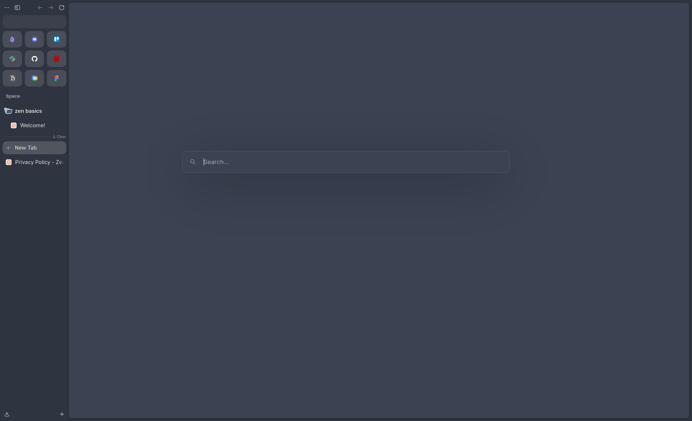
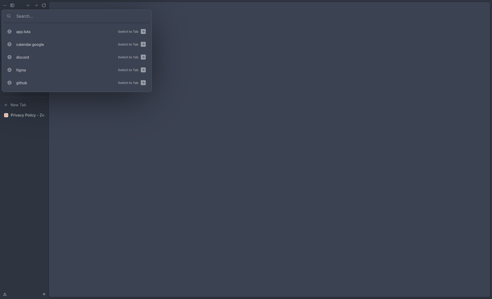
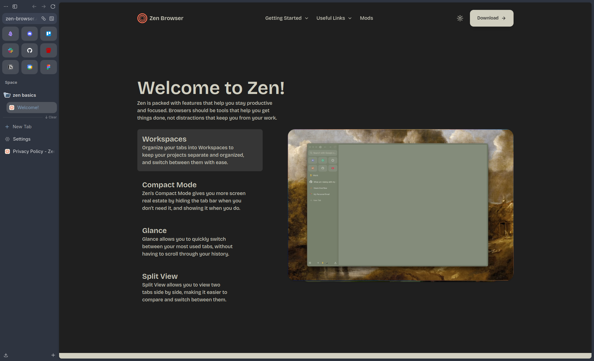
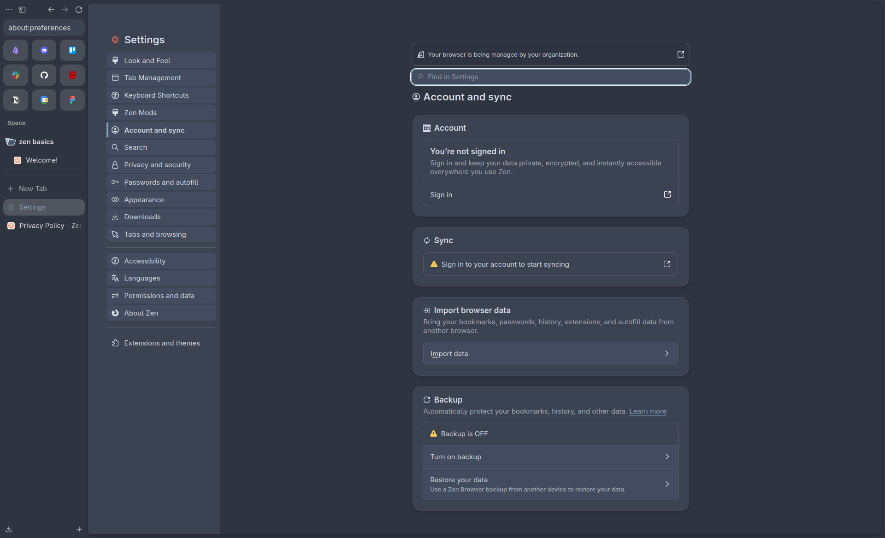

# Nord-Zen-UI

Nord-themed browser chrome for [Zen Browser](https://zen-browser.app/), updated for the modern Zen UI while preserving the original Nord aesthetic.

The theme focuses on color, contrast and small visual details. Zen's layout is intentionally left intact so that Spaces, Compact Mode, folders, Essentials and the sidebar continue to follow the browser's current implementation.

## Installation

1. Open `about:config` in Zen Browser.
2. Set `toolkit.legacyUserProfileCustomizations.stylesheets` to `true`.
3. Open `about:support` and choose **Open Directory** next to **Profile Directory**.
4. Create a `chrome` folder inside the profile directory if it does not exist.
5. Copy the contents of [`src/`](src/) into that `chrome` folder:

   ```text
   chrome/
   ├── userChrome.css
   └── userContent.css
   ```

6. Restart Zen Browser.

The theme is scoped to dark mode with `@media (prefers-color-scheme: dark)`. It does not change the appearance of normal websites.

## What changed in the modernized version

- Centralized Nord color tokens in `userChrome.css` and `userContent.css`.
- Added the current Zen background hierarchy, including `#zen-browser-background`, `#zen-toolbar-background`, `#navigator-toolbox` and `#commonDialog`.
- Updated the URL bar, autocomplete rows, panels, tooltips, workspaces and identity colors.
- Kept URL suggestions enabled instead of hiding `.urlbarView-results`.
- Updated internal Firefox/Zen pages such as `about:newtab`, `about:config`, `about:preferences`, `about:protections` and `about:addons`.
- Added a local Nord logo asset so the new-tab override does not depend on an external URL.

## Compatibility and maintenance

The files use current selectors alongside a few legacy selectors where both are harmless. When Zen changes its chrome structure again, the first places to review are:

- the background hierarchy in `userChrome.css`;
- URL bar and panel selectors;
- the shared internal-page variables in `userContent.css`.

CSS customizations are inherently tied to Zen's internal UI, so a browser update can still require selector adjustments. If a new release changes the layout, please include the Zen version and a screenshot when opening an issue.

## Preview








